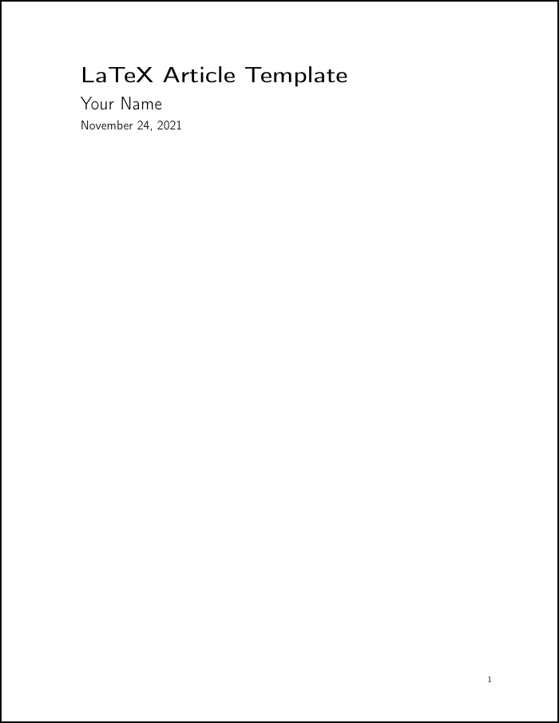

# LaTeX Templates

Templates I've designed for LaTeX documents

## Article

The article uses the three following files:

* **article.tex**- This is the main document file where document content goes.
  I've different lines of this to explain what they do and what editing them changes.
* **commands.tex**- This file has my custom commands to style the headings, title, and lists.
  This file has a commented out section (lines that start with `%`) that can number each section in the body of the document if you'd like them numbered.
  Also change the line `\setcounter{secnumberdepth}{0}` to the section numbering depth you'd like in your document  table of contents (TOC). `0` means show no numbers at any level, where `3` would number the sections, subsections, and subsubsections in the TOC.
* **packages.tex**- This file contains all the packages I use in this template.
  More packages may need to be added to extend the functionality of this template if you'd like it to do more.
  I did already include the table and graphics packages you need to include tables and images in the document.

## Resume

The resume is made up of the three following files:

* **resume.tex**- Edit this file with information you want to appear on your resume.
  The file is filled with template information you can use as examples.
* **commands.tex**- This file has my custom commands to style the headings, title, and lists.
  This file shouldn't need to be edited unless you want to change the document style.
* **packages.tex**- This file contains all the packages I use in this template.

The main resume file needs the commands.tex and packages.tex file in order to work, so you should copy the entire folder when you want to make another copy of this resume (this is a good idea with any LaTeX document).
